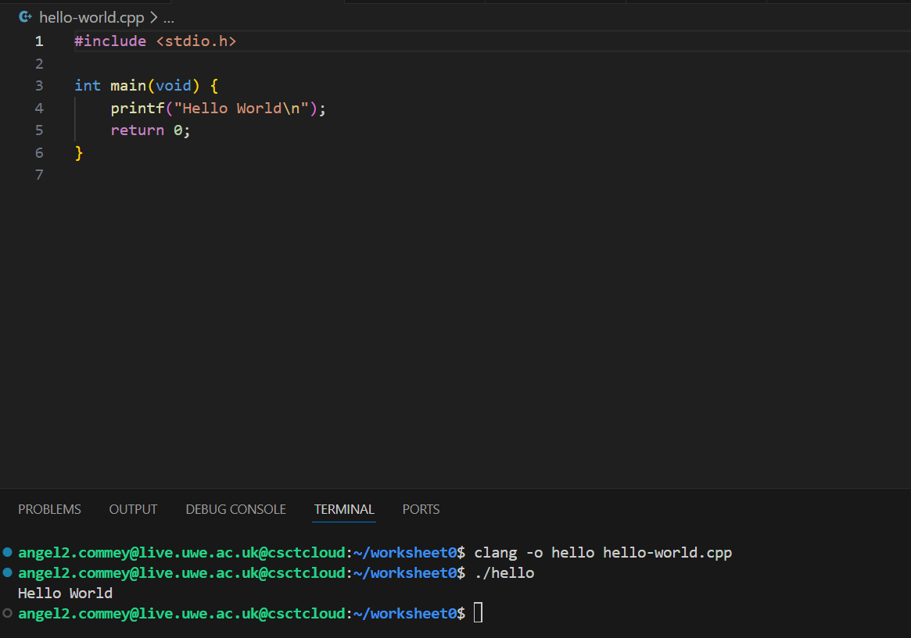
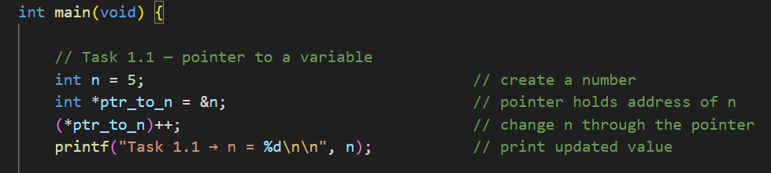
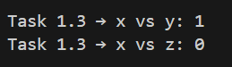
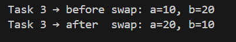
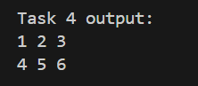

# Worksheet 0
This README documents my step-by-step approach to completing all tasks for Worksheet 0 covering pointers, arrays, file handling, void pointers, 2D arrays, and TicTacToe.
```
The main goal of this worksheet is to make sure i understand the basics of C and pointers before i start the real operating systems worksheets.
```

## TASKS VERVIEW.

- [x] **COMPILING USING CLANG**

  - To begin, I created the file hello-world.cpp.

  - Then, I compiled the program using:

     `clang -o hello hello-world.cpp`

    This produced the executable hello, which runs successfully and prints Hello World, verifying that compilation and execution functioned correctly.
    


---

- [x] **TASK 1 COMPLETED**

I declared a local variable `n`, created a pointer `ptr_to_n` pointing to it and then increase the value of `n` through the pointer, showing the indirect memory access which explains how C manages data.



- Then, I compiled the program using:

     `clang -o basic_pointers basic_pointers.c` and run it with `./basic pointers` (same for the other task 1 tasks)


---

The next part of task 1, insisted of creating the array {10, 30, 2000} and using a pointer to traverse its elements.
For each element, I printed:

  - Its value

  - Its memory address

  - The pointer movement caused by pointer arithmetic

This task helped reinforce the relationship between arrays and pointers. 


---
The next task was to write a function that:

- Takes two pointers to arrays

- Takes a length

- Returns 1 if the arrays are equal

- Returns 0 if not

So i:

1. Wrote a function arrays_equal(int *a, int *b, int len).

2. Checked both pointers are not null.

3. Looped through each index comparing elements.

4. Returned 1 only if all elements matched.

This task strengthened my understanding of pointer dereferencing, loop design, and defensive programming.



---

In the next program, i I created a program that reads integers from the file foo.txt:
`10
20
30
40
54`

The program:

  - Opens the file safely

  - Reads integers using fscanf

  - Accumulates a running total

  - Prints the final sum

   - Handles invalid or missing files

This task improved my understanding of file pointers, I/O functions, and error control.


---

This task introduced void pointers.
I needed to:

-  Implement a generic swap function using void *

-  Test it on two integers, then two floats

Here is how i did it:

1. I Wrote the function:

   `void swap(void *x, void *y, size_t size);`

2. Used a temporary buffer + memcpy to swap the memory contents.

3. Tested it with integers and floats to prove it works on any data type.



---

To conclude this task required me to print a 2D array using only a pointer to the first element.

Here is what i did:

- Stored a 2D grid in a 1D block of memory.

- Used indexing formula:

  `arr[y * width + x]`

- Printed elements row-by-row inside nested loops.



---

[x] TicTacToe

The final task was to Implement TicTacToe.

I used multiple C files (.c and .h) amd used at least one function involving pointers.

I did this by:

1. Creating the files: `main.c
game.c
game.h
board.c
board.h`

2. Using pointers when updating board positions.

2. Designing a simple input loop to play the game.

3. Implementing win checking, drawing the board, and switching turns.

_To compile the game i used this code_:

 `clang -o tictactoe main.c game.c` and run it with `./tictactoe`


---

_I  am now going to commit and push my project onto my gitlab repo by doing:_


`git add .`

`git commit -m "Completed Worksheet 0"`

`git push`

---

